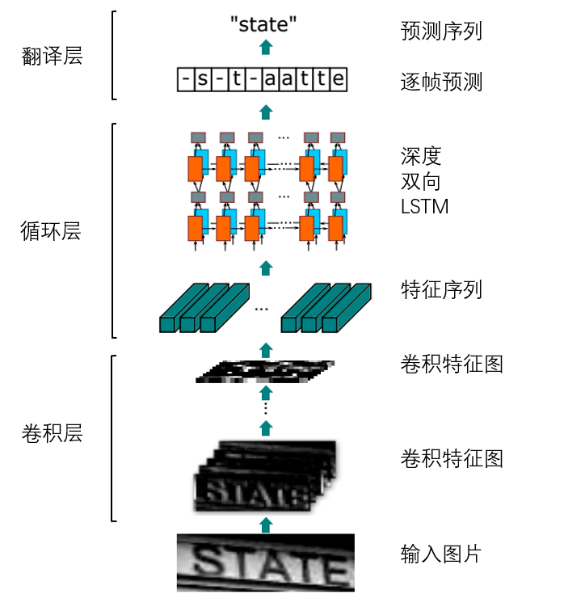
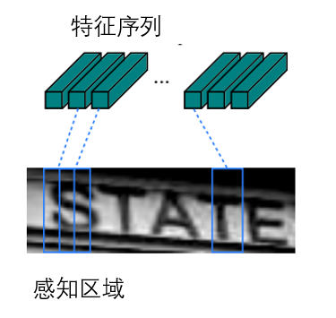
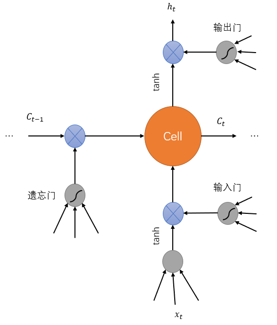

# OCR 论文

翻译自: [An End-to-End Trainable Neural Network for Image-based Sequence Recognition and Its Application to Scene Text Recognition](https://arxiv.org/abs/1507.05717).

原作者: Baoguang Shi, Xiang Bai and Cong Yao
School of Electronic Information and Communications
Huazhong University of Science and Technology, Wuhan, China

翻译人员:LazyCat

完成时间:

校对:LazyCat

**(本人英语能力有限,如有错误请见谅!)**

## 摘要

基于图像的序列识别一直是计算机视觉的一项长久的研究话题.在本论文中,我们探讨了场景文本识别的问题所在.它在基于图像的序列识别问题中是一个最重要,也最富有挑战性的任务.

我们提出了一个崭新的神经网络架构,它整合了特征提取和序列建模,将它们转换为了一个统一的框架.对比之前的场景文字识别系统,我们提出的这个架构有如下四个不同的特性:

- 它是端到端训练的.不同于大多数现成的算法,这些算法的不同组件需要单独训练和调整.
- 它可以很自然地处理不同长度的序列.不涉及字符分割和水平尺度归一化.
- 它不局限于任何已经定义好的词典.不论是在无词典还是有词典的场景文字识别任务中,它都表现地非常好.
- 它训练出来的模型更加轻量但是非常有效.这在实际应用场景中更加有用.

在标准的基准上进行的一些实验,包括IIIT-5K,街道文字识别和ICDAR数据集,都证明了在现有技术之上此算法的优越性.另外,此算法在基于图像的乐谱识别任务中表现地很好.这明显地验证了它的通用性.

## 1.介绍

最近,社区见证了神经网络的强势复兴.这主要是受到深度神经网络模型成功的刺激.特别是深度卷积神经网络(DCNN)在不同视觉任务上的成功.然而,这些网络主要都致力于解决检测和对象类别分类问题.

在这篇论文中,我们关心另外一个计算机视觉的经典问题:基于图像的序列识别.

在实际世界中,稳定的视觉对象,例如科学文章,手写体和乐谱,很多都倾向于以序列的方式出现,而不是孤立的.不同于一般的对象识别,识别这样的"类序列对象"(sequence-like objects)通常需要系统去预测一系列的标签,而不是单一的标签.因此,对这些对象的识别可以被自然地看作是序列识别问题.

类序列对象的另外一个特别的属性是,它们的长度可能完全不一样.例如,英语单词可以包含两个字符例如"OK",也可以包含15个字符例如"congratulations".所以,最出名的深度模型例如DCNN不可以直接应用于序列检测,因为DCNN模型通常在维度固定的输入和输出上运行,因此它对于产生长度可变的序列是无能为力的.

已经有人做了一些尝试去解决这种特定的类序列对象的识别问题.例如[35, 8]()中的算法先检测出单一的字符,然后用DCNN模型(使用标签好的字符图片训练的)去识别这些检测到的字符.这样的模型通常需要训练出一个强大的字符检测器来精确地检测并从原始图片中裁剪出每个字符.另外一个尝试是把场景图像识别看作成一个图像分类问题,并为每个类别标签分配一个英文单词(一共有90K个单词).它产生了一个巨大的训练好的模型和海量标签.这样的做法很难去识别那些除了英文以外的其它类型的类序列对象,例如中文,乐谱等.因为这种序列的基础组合数量可以高达上百万.总之,目前这些基于DCNN的系统不可以直接被用来进行基于图像的序列识别.

循环神经网络模型(RNN),是深度神经网络家族中的另外一个重要的分支,它主要是被设计用来处理序列的.RNN的一个优势是不管在训练还是测试的时候,它都不需要知道每个元素在序列图片对象中的位置.但是通常需要将输入图片对象转换为一个图片特征序列的预处理步骤.例如Graves从手写文本图片中提取了一组几何或图像特征,而Su和Lu将单词图像转换为连续的HOG特征.在这种处理流中,预处理步骤独立于随后的组件.因此现存的基于RNN的系统无法实现端到端的训练和优化.

几种不基于神经网络的传统场景文字识别方法同样对这个领域带来了富有见地的想法和新颖的表现.例如,Almazan和Rodriguez-Serrano提出将字母图片和文本字符串嵌入在一个共同的矢量子空间内.这样单词识别就被转换为了一个检索问题.Yao和Gordo使用中级特征进行场景文本识别.这些方法基本都优于之前基于神经网络的算法,以及本文提出的方法,尽管它们(这里指基于神经网络的算法和本文提出的算法,译者注)在标准基准上表现得很好.

这篇论文的主要贡献是一个新的神经网络模型.这个模型是专门被设计用来识别图像中的类序列对象.这个提出的神经网络模型叫做**卷积循环神经网络**(Convolutional Recurrent Neural Network, CRNN),因为它是DCNN和RNN的组合.对于类序列对象识别,CRNN和传统的神经网络模型相比,有如下几个独特的优势:

- 它可以直接从序列标签中学习(例如,多个单词),不需要详细的注释(例如,多个字符).
- 在直接学习来自图片的信息表示上,它拥有和DCNN同样的特性.既不需要手动提取特征也不需要预处理过程,包括二值化/分割,组件定位等.
- 它拥有和RNN的同样特征,能够产生一系列标签.
- 它不受类序列对象长度的约束,仅需要在训练和测试阶段的高度归一化.
- 和现有的技术相比,它在场景文本(单词识别)有着更出色和更有竞争力的表现.
- 它的参数比传统的DCNN要少得多,占用更少的储存空间.

## 2.网络结构

CRNN的网络结构图如下所示:

网络从底部到顶部由3个组件组成:卷积层,循环层和一个翻译层.

在CRNN的底部,卷积层从每个输入图片中自动提取出一个特征序列.在卷积网络的上面,一个循环网络被构建用来对每一帧的特征序列做出预测.在CRNN的顶部,翻译层被用来把逐帧的来自循环层的预测翻译为一个标签序列.虽然CRNN是由不同的网络架构(CNN和RNN)组成的,但是它可以在一个共同的损失函数上训练.

### 2.1 特征序列提取

在CRNN模型中,卷积层组件是用来自标准CNN模型的卷积层(convolutional layer)和最大池化层(max-pooling layer)构建的(全连接层被移除了).这个组件被用来提取来自输入图片的特征序列.在把图片输入网络之前,所有图片必须被缩放成相同的高度,接着一个特征序列向量就被从卷积层组件提供的特征图中提取了出来.这个向量是循环层的输入.特别地,每个特征序列中的特征向量是从特征图中从按照列左到右生成的.这意味第i个特征向量是和所有图中的第i列并列的.我们假设每一列的宽度固定为单个像素.

由于卷积,最大池化和元素激活函数在局部区域上运行,它们具有平移不变性.因此,特征图的每一列对应于原始图像中的一个矩形区域(被称为感知区域),并且这些矩形区域从左到右的顺序和特征图中对应的列的从左到右的顺序是一样的,如下图所示:

深度卷积特征是如此的强大,丰富和可训练的,它已经被广泛用于各种视觉识别任务.一些先前的方法已经使用CNN来学习类序列对象(例如场景文本)的鲁棒表示.然而,这些方法通常使用CNN提取图片的整体特征,然后再收集局部深层特征来识别类序列对象的每个分量.因为CNN要求输入图片被缩放为一个固定的尺寸来满足它固定的输入维度,这对于长度变化很大的类序列对象来说并不合适.在CRNN中,我们将深度特征表达为顺序表示,使得其在类序列对象的长度改变中保持不变.

### 2.2 序列标记

一个深度双向循环网络被构建在卷积层的上方,作为循环层.循环层对每一来自特征序列$\mathbf{x}=x_1,\dots,x_T$的帧$x_t$,都给出一个标签分量$y_t$.循环层有着三方面的优势:

- RNN有着从序列中提取上下文信息的强大能力.在基于图像的序列识别中使用上下文线索比单独地处理每个符号更加的稳定和有用.以场景文本识别为例,宽字符可能需要连续的多个帧来表示.此外,在观察它们的前后关系后,一些模棱两可的字符可以更容易地去区分.例如,要区分"il"中的"i"和"l",把它们放在一起按照高度区分比把它们分开要容易得多.
- RNN可以将误差反向传播到其输入,即卷积层.这允许我们在一个统一的网络中同时训练循环层和卷积层.
- RNN能够对任意长度的序列进行操作,从序列头到尾进行遍历.

一个传统的RNN单元在输入和输出层之间有自连接的隐藏层.每个时间点它接收序列中的一帧$x_t$,它使用一个接收当前输入$x_t$和上一个状态$h_{t-1}$的非线性函数$h_t=g(x_t,h_{t-1})$来更新其内部状态$h_t$.输出$y_t$是基于$h_t$的.这样,之前的上下文$\lbrace x_{t'}\rbrace_{t'\lt t}$被捕获并影响到预测.然而,传统的RNN单元,饱受梯度消失问题的影响,这限制了它能储存的上下文信息,并增加了训练的负担.长短期记忆(LSTM)是另外一种RNN单元,它被专门用来解决这个问题.一个LSTM单元如下图所示:

一个LSTM单元包含了一个记忆单元和三个门,叫做输入,输出和遗忘门.理论上,记忆单元储存了之前的上下文,而输入和输出门允许单元储存一些非常久远的上下文.与此同时,单元中的记忆可以被遗忘门清除一部分.这种特殊的LSTM单元设计让它能储存一些长久的依赖,这经常出现在基于图像的序列中.

LSTM是定向的,它仅用了以前的上下文.然而,在基于图像的队列中,来自各个方向的上下文都是有用的并且是互相补充的.因此,我们
